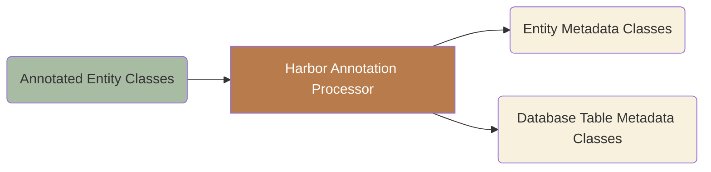

# HarborORM

HarborORM is a powerful Java ORM library that enables you to write your business logic backed by an RDBMS quickly and with ease.

## Table of contents

- [Motivation](#motivation)
- [Getting started](#getting-started)
  - [Annotation processing flow](#annotation-processing-flow)
  - [Entity operations with repositories](#entity-operations-with-repositories)
  - [Data retrieval with table metadata](#data-retrieval-with-table-metadata)
  - [QEntity vs Table — when to use which](#qentity-vs-table--when-to-use-which)
- [Adding HarborORM to a project](#adding-harbororm-to-a-project)
- [Using HarborORM in Spring Boot](#using-harbororm-in-spring-boot)
  - [Custom AttributeConverter supplier](#custom-attributeconverter-supplier)
  - [SQL Query Monitoring](#sql-query-monitoring)
- [Creating entities in HarborORM](#creating-entities-in-harbororm)
  - [Simple columns](#simple-columns)
  - [ID generation](#id-generation)
  - [Entity callbacks](#entity-callbacks)
  - [Enumerated column types](#enumerated-column-types)
  - [JSON/JSONB columns](#jsonjsonb-columns)
  - [Field type conversion](#field-type-conversion)
  - [Embedded classes](#embedded-classes)
  - [Element collections](#element-collections)
  - [Relations](#relations)
- [Advanced entity features](#advanced-entity-features)
  - [Optimistic locking](#optimistic-locking)
  - [Blobs and Clobs](#blobs-and-clobs)
  - [Custom type handlers](#custom-type-handlers)
- [Advanced querying](#advanced-querying)
  - [SQL Views](#sql-views)
  - [Stored Procedures and Functions](#stored-procedures-and-functions)
  - [Streaming data](#streaming-data)
  - [Common Table Expression (CTE)](#common-table-expression-cte)
  - [Multiset aggregation](#multiset-aggregation)
  - [Full-Text Search](#full-text-search)
  - [LATERAL JOIN](#lateral-join)

## Motivation

HarborORM is inspired heavily by Hibernate/JPA for data manipulation and jOOQ/Querydsl for data retrieval.

It aspires to bring the best out of these two worlds.


Benefits from using HarborORM:

* single source of metadata for your data manipulation and retrieval code
* metadata generation at compile time
* blazing fast booting
* familiar style of programming
* strongly typed and advanced querying with minimum code
* easiest migration between different RDBMS on the market
* TDD/DDD/BDD-ready
* straightforward integration with Spring Boot


Things that HarborORM does **not** do:

* transaction management - use a transaction manager of your choice (e.g. Spring Transaction Manager)
* caching - there is no level 1 nor level 2 caching - the library does what you instruct it to do:
  * you insert, it inserts
  * you update, it updates
  * for caching use external caching support (e.g. @Cachable in Spring Framework or similar)


## Getting started

This section walks you through the core workflow: annotate an entity, compile, and use the generated classes for CRUD operations and queries.

### Annotation processing flow

HarborORM's annotation processor runs at compile time. It reads your annotated entity classes and generates two kinds of metadata classes:



Given this entity:

```java
import io.github.thinkfastpl.harbororm.api.annotations.*;
import lombok.*;

@Entity(table = "somes")
@NoArgsConstructor
@AllArgsConstructor
@Getter
@Setter
public class SomeEntity {

    @Id
    private Long id;

    @Column(nullable = false)
    private String name;
}
```

the annotation processor generates two classes when you run `mvn compile`:

- **`QSomeEntity`** — entity metadata implementing `QEntity<SomeEntity, Long>`, with typed column references and entity lifecycle support:
  ```java
  public final QColumn<Long> id;
  public final QColumn<String> name;
  ```

- **`SomesTable`** — table metadata implementing `QTable`, with the same column references for lightweight data retrieval:
  ```java
  public final QColumn<Long> id;
  public final QColumn<String> name;
  ```

You never edit these classes — just use them. The following sections show how.

### Entity operations with repositories

Repositories give you a complete CRUD API for your entities. Create one by extending `EntityRepository`:

```java
import io.github.thinkfastpl.harbororm.core.repository.EntityRepository;

public class SomeRepository extends EntityRepository<SomeEntity, Long> {
    private static final QSomeEntity ENTITY = new QSomeEntity(null);

    public SomeRepository(HarborSession session) {
        super(session, ENTITY);
    }
}
```

That single class gives you access to all built-in operations:

```java
SomeEntity entity = new SomeEntity(null, "Alice");

// Insert
someRepository.insert(entity);

// Find
Optional<SomeEntity> found = someRepository.findById(1L);

// Update
entity.setName("Bob");
someRepository.update(entity);

// Delete
someRepository.delete(entity);
```

#### Built-in repository methods

| Method | Returns | Description |
|--------|---------|-------------|
| `insert(entity)` | `void` | Insert a new entity |
| `insertAll(entities)` | `void` | Insert multiple entities |
| `findById(id)` | `Optional<T>` | Find by primary key |
| `findByIdOrThrow(id)` | `T` | Find by primary key or throw `EntityNotFoundException` |
| `findByIdForUpdate(id)` | `Optional<T>` | Find with row-level lock |
| `findByIdForUpdateOrThrow(id)` | `T` | Find with row-level lock or throw |
| `existsById(id)` | `boolean` | Check if entity exists |
| `findAll()` | `List<T>` | Return all entities |
| `findAllById(ids)` | `List<T>` | Return entities matching given IDs |
| `streamAll()` | `Stream<T>` | Stream all entities (memory-efficient) |
| `countAll()` | `long` | Count total entities |
| `update(entity)` | `void` | Update an existing entity |
| `delete(entity)` | `void` | Delete an entity |
| `deleteAll(entities)` | `void` | Delete multiple entities |
| `deleteById(id)` | `void` | Delete by primary key |
| `deleteAllById(ids)` | `void` | Delete multiple by primary keys |

#### Custom query methods

Add domain-specific queries to your repository using the inherited `session` field:

```java
public class SomeRepository extends EntityRepository<SomeEntity, Long> {
    private static final QSomeEntity ENTITY = new QSomeEntity(null);

    public SomeRepository(HarborSession session) {
        super(session, ENTITY);
    }

    public List<SomeEntity> findAllByName(String name) {
        return session
                .selectEntity(ENTITY)
                .where(ENTITY.name.eq(name))
                .orderBy(ENTITY.id.asc())
                .fetchAll();
    }
}
```

### Data retrieval with table metadata

When you don't need full entity objects — for reports, joins, aggregations, or projections — use Table metadata classes with `session.select()`:

```java
SomesTable somes = new SomesTable(null);

List<Record> records = session
        .select(somes.id, somes.name)
        .from(somes)
        .where(somes.name.eq("Alice"))
        .fetchAll();

for (Record record : records) {
    Long id = record.get(somes.id);
    String name = record.get(somes.name);
}
```

This returns lightweight `Record` objects instead of entity instances — no lifecycle callbacks, no lazy loading, just raw data.

#### Joins with table metadata

Table classes are especially useful for joins across multiple tables:

```java
SomesTable somes = new SomesTable("s");
OthersTable others = new OthersTable("o");

List<Record> records = session
        .select(somes.name, others.value)
        .from(somes)
        .innerJoin(others).on(others.someId.eq(somes.id))
        .where(somes.name.eq("Alice"))
        .fetchAll();

for (Record record : records) {
    String name = record.get(somes.name);
    String value = record.get(others.value);
}
```

Note the string aliases (`"s"`, `"o"`) passed to the constructors — these are required when joining multiple tables to disambiguate column references.

### QEntity vs Table — when to use which

| Aspect | QEntity + `selectEntity()` | Table + `select().from()` |
|--------|---------------------------|--------------------------|
| Returns | Entity instances | `Record` objects |
| Lifecycle callbacks | Yes | No |
| Lazy-loaded relations | Yes | No |
| Type conversions (`@Convert`, `@Enumerated`) | Yes | No |
| Insert / update / delete | Yes | No |
| Best for | CRUD, business logic | Reports, joins, projections |

**Rule of thumb:** use QEntity and repositories for business entities you insert, update, and delete. Use Table classes for read-only queries, joins, aggregations, and projections.


## Adding HarborORM to a project

Add the following dependencies to your `pom.xml`:

```xml
<dependencies>
    <!-- Database Dialect (choose one) -->
    <!-- For PostgreSQL -->
    <dependency>
        <groupId>io.github.thinkfast-pl</groupId>
        <artifactId>harbor-orm-postgres</artifactId>
        <version>0.0.1-SNAPSHOT</version>
    </dependency>

    <!-- OR for H2 Database -->
    <dependency>
        <groupId>io.github.thinkfast-pl</groupId>
        <artifactId>harbor-orm-h2</artifactId>
        <version>0.0.1-SNAPSHOT</version>
    </dependency>

    <!-- Annotation Processor for Metadata Generation (compile-time only) -->
    <dependency>
        <groupId>io.github.thinkfast-pl</groupId>
        <artifactId>harbor-orm-model-gen</artifactId>
        <version>0.0.1-SNAPSHOT</version>
        <scope>provided</scope>
    </dependency>
</dependencies>
```

The dialect dependency (`harbor-orm-postgres` or `harbor-orm-h2`) transitively includes `harbor-orm-api` and `harbor-orm-core`, so no additional dependencies are needed.

To generate `*Table` metadata classes (for pure data retrieval queries), configure the target package as a compiler argument:

```xml
<plugin>
    <groupId>org.apache.maven.plugins</groupId>
    <artifactId>maven-compiler-plugin</artifactId>
    <configuration>
        <compilerArgs>
            <arg>-Aio.github.thinkfastpl.harbororm.tables.package=com.example.myapp.query</arg>
        </compilerArgs>
    </configuration>
</plugin>
```

Without this option, only `Q<EntityName>` entity metadata classes are generated.

To print the full source of each generated class to standard output during compilation (useful for debugging the annotation processor), enable source logging:

```xml
<compilerArgs>
    <arg>-Aio.github.thinkfastpl.harbororm.log.sources=true</arg>
</compilerArgs>
```

## Using HarborORM in Spring Boot

To take full advantage of Spring JDBC support configure it like that:

```java
import io.github.thinkfastpl.harbororm.api.HarborSession;
import io.github.thinkfastpl.harbororm.core.HarborSessionFactory;
import io.github.thinkfastpl.harbororm.core.sql.SqlConnectionManager;
import io.github.thinkfastpl.harbororm.postgres.dialect.PostgreSqlRdbmsSupport;
import org.springframework.context.annotation.Bean;
import org.springframework.context.annotation.Configuration;
import org.springframework.jdbc.datasource.DataSourceUtils;

import javax.sql.DataSource;
import java.sql.Connection;

@Configuration
class HarborConfiguration {

    @Bean
    HarborSession session(DataSource dataSource) {
        SqlConnectionManager connectionManager = new SqlConnectionManager() {
            @Override
            public Connection acquireConnection() {
                return DataSourceUtils.getConnection(dataSource);
            }

            @Override
            public void releaseConnection(Connection connection) {
                DataSourceUtils.releaseConnection(connection, dataSource);
            }
        };

        return HarborSessionFactory.builder()
                .connectionManager(connectionManager)
                .rdbmsSupport(new PostgreSqlRdbmsSupport())
                .build();
    }
}
```

This way you'll have only one HarborSession instance in the app that you can inject anywhere, and it will correctly participate in database transactions managed by Spring.

If you don't use PostgreSQL select appropriate RDBMS support implementation class instead of PostgreSqlRdbmsSupport.

### Custom AttributeConverter supplier

By default, `@Convert` converters are instantiated via their no-arg constructor. If you need more control over how converters are created (e.g. to use Spring beans with injected dependencies), pass a custom `AttributeConverterSupplier` to the factory method:

```java
@Configuration
class HarborConfiguration {

    @Bean
    HarborSession session(DataSource dataSource, ApplicationContext applicationContext) {
        SqlConnectionManager connectionManager = new SqlConnectionManager() {
            @Override
            public Connection acquireConnection() {
                return DataSourceUtils.getConnection(dataSource);
            }

            @Override
            public void releaseConnection(Connection connection) {
                DataSourceUtils.releaseConnection(connection, dataSource);
            }
        };

        AttributeConverterSupplier converterSupplier = clazz -> {
            try {
                return applicationContext.getBean(clazz);
            } catch (NoSuchBeanDefinitionException e) {
                return clazz.getConstructor().newInstance();
            }
        };

        return HarborSessionFactory.builder()
                .connectionManager(connectionManager)
                .rdbmsSupport(new PostgreSqlRdbmsSupport())
                .attributeConverterSupplier(converterSupplier)
                .build();
    }
}
```

The supplier is called once per converter class and the result is cached. Converters that are not registered as Spring beans fall back to the default no-arg constructor instantiation in the example above.

### SQL Query Monitoring

Use `SqlQueryMonitor` to observe every SQL query before and after execution. This is useful for logging, timing, debugging, and metrics collection.

#### Implementing a monitor

```java
import io.github.thinkfastpl.harbororm.core.sql.SqlQueryMonitor;
import io.github.thinkfastpl.harbororm.core.sql.dialect.SqlQuery;

SqlQueryMonitor monitor = new SqlQueryMonitor() {
    @Override
    public void beforeQuery(SqlQuery query) {
        log.debug("Executing: {}", query.getSql());
    }

    @Override
    public void afterQuery(SqlQuery query, long executionTimeMs, Exception exception) {
        if (exception != null) {
            log.error("Query failed after {}ms: {}", executionTimeMs, query.getSql(), exception);
        } else if (executionTimeMs > 100) {
            log.warn("Slow query ({}ms): {}", executionTimeMs, query.getSql());
        }
    }
};
```

#### Registering the monitor

Pass the monitor when building the session:

```java
HarborSession session = HarborSessionFactory.builder()
        .connectionManager(connectionManager)
        .rdbmsSupport(new PostgreSqlRdbmsSupport())
        .sqlQueryMonitor(monitor)
        .build();
```

Both callback methods have default no-op implementations, so you only need to override the methods you care about. If the SQL execution throws an exception, `afterQuery` is called with the exception before it is rethrown to the caller.

## Creating entities in HarborORM

### Simple columns

Mark a class as a database entity with `@Entity` and define its primary key with `@Id`:

```java
@Entity(table = "products")
public class ProductEntity {

    @Id
    private Long id;

    @Column(nullable = false)
    private String name;

    @Column(nullable = false)
    private BigDecimal price;
}
```

#### @Entity parameters

| Parameter | Required | Default | Description |
|-----------|----------|---------|-------------|
| `table` | Yes | - | Database table name |
| `schema` | No | - | Database schema name |
| `columnNameStrategy` | No | `SNAKE_CASE` | How field names map to column names |

**Column naming strategies:** `CAMEL_CASE`, `PASCAL_CASE`, `SNAKE_CASE`, `SNAKE_CASE_UPPER`, `KEBAB_CASE`, `KEBAB_CASE_UPPER`

#### @Column parameters

| Parameter | Required | Default | Description |
|-----------|----------|---------|-------------|
| `name` | No | Auto-generated | Custom column name |
| `nullable` | Yes | — | Allow NULL values |
| `insertable` | No | `true` | Include in INSERT statements |
| `updatable` | No | `true` | Include in UPDATE statements |

```java
@Column(name = "display_name", nullable = true, updatable = false)
private String name;
```

#### Supported types

| Java Type | SQL Type | Notes |
|-----------|----------|-------|
| `Boolean` / `boolean` | BOOLEAN | |
| `Byte` / `byte` | TINYINT | |
| `Short` / `short` | SMALLINT | |
| `Integer` / `int` | INT | |
| `Long` / `long` | BIGINT | |
| `Float` / `float` | REAL | |
| `Double` / `double` | DOUBLE PRECISION | |
| `BigInteger` | NUMERIC | |
| `BigDecimal` | NUMERIC | |
| `Character` / `char` | CHAR | |
| `String` | VARCHAR | |
| `UUID` | UUID | |
| `LocalDate` | DATE | |
| `LocalTime` | TIME | |
| `LocalDateTime` | TIMESTAMP | |
| `OffsetDateTime` | TIMESTAMP WITH TIME ZONE | |
| `byte[]` | VARBINARY | Binary data |
| `PortableBlob` | BLOB | Large binary objects |
| `PortableClob` | CLOB | Large text objects |

#### Requirements

Entities must have a no-argument constructor (can be private). Fields are accessed directly via reflection. Getters and setters are never called to access columns' fields even when they are implemented.
### ID generation

HarborORM supports three ID generation strategies:

#### Manual assignment

Assign ID values directly before insertion:

```java
@Id
private Long id;
```

#### Auto-generated (database identity)

Use database auto-increment:

```java
@Id
@AutoGenerated
private Long id;
```

The generated value is populated in the entity after insertion.

#### Sequence-generated

Use a database sequence:

```java
@Id
@SequenceGenerated(sequence = "products_id_seq")
private Long id;
```

| Parameter | Required | Description |
|-----------|----------|-------------|
| `sequence` | Yes | Name of the database sequence |

The sequence is called before insertion and the value is set on the entity.

#### Composite IDs

Use `@Embedded` for composite primary keys:

```java
@Embeddable
public class OrderItemId {

    @Column(name = "order_id", nullable = false)
    private Long orderId;

    @Column(name = "product_id", nullable = false)
    private Long productId;
}

@Entity(table = "order_items")
public class OrderItemEntity {

    @Id
    @Embedded
    private OrderItemId id;

    @Column(nullable = false)
    private int quantity;
}
```

#### Supported ID types

Any type from the supported types table can be used as an ID, including `UUID`:

```java
@Id
private UUID id;
```
### Entity callbacks

Use lifecycle callback annotations to execute logic at specific points in an entity's persistence lifecycle:

```java
@Entity(table = "articles")
public class ArticleEntity {

    @Id
    private Long id;

    @Column(nullable = false)
    private String title;

    @Column(name = "created_at", nullable = false)
    private LocalDateTime createdAt;

    @Column(name = "updated_at", nullable = false)
    private LocalDateTime updatedAt;

    private transient String displayTitle;

    @PreInsert
    void onPreInsert() {
        this.createdAt = LocalDateTime.now();
    }

    @PreUpdate
    void onPreUpdate() {
        this.updatedAt = LocalDateTime.now();
    }

    @PreDelete
    void onPreDelete() {
        // perform cleanup before deletion
    }

    @PostInsert
    void onPostInsert() {
        // entity and all children have been persisted
    }

    @PostUpdate
    void onPostUpdate() {
        // entity and all children have been updated
    }

    @PostDelete
    void onPostDelete() {
        // entity has been deleted from the database
    }
}
```

#### Available callbacks

| Annotation | Trigger | Use case |
|------------|---------|----------|
| `@PreInsert` | Before `INSERT` | Set creation timestamps, generate default values |
| `@PostInsert` | After `INSERT` (including cascaded children) | Logging, populating transient fields |
| `@PreUpdate` | Before `UPDATE` | Set modification timestamps, increment counters |
| `@PostUpdate` | After `UPDATE` (including cascaded children) | Logging, populating transient fields |
| `@PreDelete` | Before `DELETE` | Cleanup, audit logging, validation |
| `@PostDelete` | After `DELETE` (including cascaded children) | Cleanup of external resources, notifications |

#### Pre vs Post callbacks

**Pre-callbacks** (`@PreInsert`, `@PreUpdate`, `@PreDelete`) fire before the SQL statement executes. Changes to `@Column` fields in pre-callbacks are included in the SQL statement and persisted to the database.

**Post-callbacks** (`@PostInsert`, `@PostUpdate`, `@PostDelete`) fire after the full aggregate operation completes, including all cascaded children (`@OneToMany`, `@OneToOne`), element collections, and many-to-many join table rows. Since the SQL has already executed, changes to `@Column` fields will **not** be persisted. Use post-callbacks for non-persistent side effects such as logging, populating transient fields, or sending notifications.

#### Rules

- Callback methods must have no parameters
- Callback methods can have any access modifier
- Multiple methods can have the same callback annotation
- Callbacks execute in declaration order
- Avoid database operations inside callbacks
- All callbacks also work on `@Embeddable` classes (invoked recursively)
### Enumerated column types

Use `@Enumerated` to map Java enums to database columns:

```java
public enum Status {
    ACTIVE, INACTIVE, PENDING
}

@Entity(table = "accounts")
public class AccountEntity {

    @Id
    private Long id;

    @Column(nullable = false)
    @Enumerated(EnumMappingType.STRING)
    private Status status;
}
```

#### Mapping types

| Type | Storage | Example value | Notes |
|------|---------|---------------|-------|
| `STRING` | VARCHAR | `"ACTIVE"` | Readable, safe for refactoring order |
| `ORDINAL` | INT | `0` | Compact, breaks if enum order changes |

Default is `STRING` when no parameter is specified.

#### PostgreSQL custom enum types

Use `@Type` to map to a PostgreSQL enum type:

```java
@Column(nullable = false)
@Enumerated
@Type(dialect = StandardDialects.POSTGRES, columnType = "account_status")
private Status status;
```

This generates SQL using the custom type instead of VARCHAR.

#### @Type parameters

| Parameter | Required | Description |
|-----------|----------|-------------|
| `dialect` | Yes | `StandardDialects.POSTGRES` or `StandardDialects.ANY` |
| `columnType` | Yes | Database type name |

#### Nullable enums

```java
@Column(nullable = true)
@Enumerated(EnumMappingType.STRING)
private Status secondaryStatus;
```
### JSON/JSONB columns

Use `@Json` to mark entity fields as JSON columns. This enables JSON-aware storage (PostgreSQL `jsonb`, H2 `json` — plain `varchar` columns keep working) and unlocks JSON query operators in the DSL.

#### Basic usage — String fields

For fields that are already JSON strings, `@Json` requires no additional configuration:

```java
@Entity(table = "events")
public class EventEntity {

    @Id
    private Long id;

    @Json
    @Column(nullable = false)
    private String payload; // stored as-is in JSONB/VARCHAR
}
```

#### POJO fields with JsonSerializer

For typed POJO fields, provide a `JsonSerializer` when creating the session. This enables automatic serialization (write) and deserialization (read):

```java
@Entity(table = "users")
public class UserEntity {

    @Id
    private Long id;

    @Json
    @Column(nullable = false)
    private Address address; // serialized via JsonSerializer
}
```

Configure the session with a serializer (e.g., Jackson):

```java
JsonSerializer jacksonSerializer = new JsonSerializer() {
    private final ObjectMapper mapper = new ObjectMapper();

    @Override
    public String serialize(Object value) {
        return mapper.writeValueAsString(value);
    }

    @Override
    public <T> T deserialize(String json, Class<T> type) {
        return mapper.readValue(json, type);
    }
};

HarborSession session = HarborSessionFactory.builder()
    .connectionManager(connectionManager)
    .rdbmsSupport(rdbmsSupport)
    .jsonSerializer(jacksonSerializer)
    .build();
```

#### POJO fields with @Convert (no JsonSerializer needed)

You can also use `@Json` with `@Convert` for manual conversion. This works with regular sessions — no `JsonSerializer` required:

```java
@Json
@Column(nullable = false)
@Convert(converter = AddressJsonConverter.class)
private Address address;
```

#### JSON query operators

`QJsonColumn` exposes JSON-specific methods for building type-safe queries.

**Extraction** (PostgreSQL only):

```java
QUserEntity USER = new QUserEntity(null);

// Extract text value: ->> operator
session.selectEntity(USER)
    .where(USER.payload.extractText("status").eq("active"))
    .fetchAll();

// Chain extraction: -> then ->>
session.select(USER.payload.extract("address").extractText("city"))
    .from(USER.getTableName())
    .fetchAll();

// Extract by path: #>> operator
session.select(USER.payload.extractPathText("address", "city"))
    .from(USER.getTableName())
    .fetchAll();
```

**Containment** (PostgreSQL only):

```java
// @> operator — does column contain this JSON?
session.selectEntity(USER)
    .where(USER.payload.contains(DSL.json('{"role":"admin"}')))
    .fetchAll();

// <@ operator — is column contained in this JSON?
session.selectEntity(USER)
    .where(USER.payload.containedIn(DSL.json('{"role":"admin","active":true}')))
    .fetchAll();
```

**Key existence** (PostgreSQL only):

```java
// ? operator — does key exist?
session.selectEntity(USER)
    .where(USER.payload.hasKey("email"))
    .fetchAll();

// ?| operator — does any key exist?
session.selectEntity(USER)
    .where(USER.payload.hasAnyKey("email", "phone"))
    .fetchAll();

// ?& operator — do all keys exist?
session.selectEntity(USER)
    .where(USER.payload.hasAllKeys("email", "phone"))
    .fetchAll();
```

#### Database support matrix

| Feature | PostgreSQL | H2 |
|---------|:----------:|:--:|
| CRUD with `@Json` String | Yes | Yes |
| CRUD with `@Json` POJO | Yes | Yes |
| `@Json` + `@Convert` | Yes | Yes |
| `extractText()` / `extract()` | Yes | No |
| `extractPathText()` | Yes | No |
| `contains()` / `containedIn()` | Yes | No |
| `hasKey()` / `hasAnyKey()` / `hasAllKeys()` | Yes | No |

Unsupported operations on H2 throw `UnsupportedOperationException` at query execution time.
### Field type conversion

Use `@Convert` to define custom mappings between Java types and database types.

#### Implementing a converter

Create a class implementing `AttributeConverter<EntityType, DatabaseType>`:

```java
public class BooleanToYesNoConverter implements AttributeConverter<Boolean, String> {

    @Override
    public String convertToDatabaseColumn(Boolean attribute) {
        if (attribute == null) return null;
        return attribute ? "Y" : "N";
    }

    @Override
    public Boolean convertToEntityAttribute(String dbData) {
        if (dbData == null) return null;
        return "Y".equals(dbData);
    }
}
```

#### Using a converter

```java
@Entity(table = "subscriptions")
public class SubscriptionEntity {

    @Id
    private Long id;

    @Column(name = "active_flag", nullable = false)
    @Convert(converter = BooleanToYesNoConverter.class)
    private Boolean active;
}
```

#### @Convert parameters

| Parameter | Required | Description |
|-----------|----------|-------------|
| `converter` | Yes | Class implementing `AttributeConverter` |

#### Guidelines

- Always handle `null` values explicitly in both methods
- Converters must have a no-argument constructor
- Converters are instantiated once and reused
- Keep conversion logic simple and stateless
- The same converter can be used on multiple fields
### Embedded classes

Use `@Embeddable` to define reusable value objects that map to columns in the parent entity's table.

#### Defining an embeddable

```java
@Embeddable
public class Address {

    @Column(nullable = false)
    private String street;

    @Column(name = "postal_code", nullable = false)
    private String postalCode;

    @Column(nullable = false)
    private String city;
}
```

#### Embedding in an entity

```java
@Entity(table = "customers")
public class CustomerEntity {

    @Id
    private Long id;

    @Column(nullable = false)
    private String name;

    @Embedded
    private Address address;
}
```

This maps to columns: `id`, `name`, `street`, `postal_code`, `city` in the `customers` table.

#### @Embedded parameters

| Parameter | Required | Description |
|-----------|----------|-------------|
| `tableFieldNamePrefix` | No | Prefix for generated column names |

#### Embedding the same class multiple times

Use `tableFieldNamePrefix` and `@AttributeOverride` to distinguish columns:

```java
@Entity(table = "shipments")
public class ShipmentEntity {

    @Id
    private Long id;

    @Embedded(tableFieldNamePrefix = "origin")
    @AttributeOverrides({
        @AttributeOverride(name = "street", column = @Column(name = "origin_street", nullable = false)),
        @AttributeOverride(name = "postalCode", column = @Column(name = "origin_postal_code", nullable = false)),
        @AttributeOverride(name = "city", column = @Column(name = "origin_city", nullable = false))
    })
    private Address originAddress;

    @Embedded(tableFieldNamePrefix = "destination")
    @AttributeOverrides({
        @AttributeOverride(name = "street", column = @Column(name = "dest_street", nullable = false)),
        @AttributeOverride(name = "postalCode", column = @Column(name = "dest_postal_code", nullable = false)),
        @AttributeOverride(name = "city", column = @Column(name = "dest_city", nullable = false))
    })
    private Address destinationAddress;
}
```

#### @AttributeOverride parameters

| Parameter | Required | Description |
|-----------|----------|-------------|
| `name` | Yes | Field name in the embeddable class |
| `column` | Yes | `@Column` annotation with custom mapping |
### Element collections

Use `@ElementCollection` to store collections of simple values or embeddables in a separate table.

#### Simple type collections

```java
@Entity(table = "articles")
public class ArticleEntity {

    @Id
    private Long id;

    @Column(nullable = false)
    private String title;

    @ElementCollection(
        table = "article_tags",
        joinColumns = @JoinColumn(name = "article_id", fieldType = Long.class)
    )
    private List<@Column(name = "tag", nullable = false) String> tags;
}
```

This creates an `article_tags` table with columns `article_id` and `tag`.

#### @ElementCollection parameters

| Parameter | Required | Description |
|-----------|----------|-------------|
| `table` | Yes | Name of the collection table |
| `schema` | No | Database schema name |
| `joinColumns` | Yes | Join column(s) referencing the parent entity |

#### Embeddable collections

Store complex value objects in the collection table:

```java
@Embeddable
public class PhoneNumber {

    @Column(name = "phone_type", nullable = false)
    private String type;

    @Column(name = "phone_number", nullable = false)
    private String number;
}

@Entity(table = "contacts")
public class ContactEntity {

    @Id
    private Long id;

    @Column(nullable = false)
    private String name;

    @ElementCollection(
        table = "contact_phones",
        joinColumns = @JoinColumn(name = "contact_id", fieldType = Long.class)
    )
    private List<@Embedded PhoneNumber> phoneNumbers;
}
```

#### Collections with enums

```java
@ElementCollection(
    table = "user_roles",
    joinColumns = @JoinColumn(name = "user_id", fieldType = Long.class)
)
private List<
    @Column(name = "role", nullable = false)
    @Enumerated(EnumMappingType.STRING)
    Role> roles;
```

#### PostgreSQL custom types in collections

```java
@ElementCollection(
    table = "role_permissions",
    joinColumns = @JoinColumn(name = "role_id", fieldType = Long.class)
)
private List<
    @Column(name = "permission", nullable = false)
    @Type(dialect = StandardDialects.POSTGRES, columnType = "permission_type")
    @Enumerated
    Permission> permissions;
```

#### Behavior

- Elements are loaded lazily on first access to the collection
- Loading is batched (up to 50 parents per query) for efficiency
- Inserting/updating the parent cascades to the collection
- Deleting the parent deletes all collection elements
- The collection table has no primary key by default—duplicates are allowed
### Relations

HarborORM supports `@OneToOne` and `@OneToMany` relationships. Related entities are loaded lazily when accessed.

#### One-to-one relation

Define the parent entity with a `LazyRef` to the child:

```java
@Entity(table = "users")
public class UserEntity {

    @Id
    private Long id;

    @Column(nullable = false)
    private String name;

    @OneToOne(joinColumns = @JoinColumn(
            name = "user_id",
            fieldType = Long.class
    ))
    private LazyRef<ProfileEntity> profile;
}
```

Define the child entity with the foreign key column:

```java
@Entity(table = "profiles")
public class ProfileEntity {

    @Id
    private Long id;

    @Column(name = "user_id", nullable = false)
    private Long userId;

    @Column(nullable = false)
    private String bio;
}
```

##### LazyRef API

`LazyRef<T>` is a lazy reference wrapper that loads the related entity on first access:

```java
UserEntity user = userRepository.findById(1L);

// Access the child (triggers lazy loading)
ProfileEntity profile = user.getProfile().get();              // returns ProfileEntity or null
Optional<ProfileEntity> opt = user.getProfile().toOptional(); // returns Optional<ProfileEntity>
```

To create a `LazyRef` for setting values (e.g., when creating a new parent):

```java
LazyRef<ProfileEntity> ref = LazyRef.of(new ProfileEntity(1L, null, "My bio"));
UserEntity user = new UserEntity(1L, "Alice", ref);
```

##### Behavior

The `@OneToOne` relationship follows DDD aggregate semantics — the parent entity owns and manages the child's lifecycle, just like `@OneToMany`.

**Loading:**

- The child is loaded lazily on first call to `get()` or `toOptional()`
- Loading is batched (up to 50 parents per query) for efficiency
- If multiple child rows are found for a single parent, an exception is thrown — ensure a UNIQUE constraint exists on the foreign key column in the child table

**Insert:**

Inserting a parent entity automatically cascades to insert the child. The foreign key value on the child is set from the parent's ID automatically.

```java
UserEntity user = new UserEntity(1L, "Alice",
        LazyRef.of(new ProfileEntity(1L, null, "Alice's bio")));

// Inserts the user AND the profile in one operation
userRepository.insert(user);
```

**Update:**

Updating a parent entity cascades changes to the child **only if the LazyRef was accessed** (i.e. `get()` was called). When cascading:

- If the child was modified, it is updated
- If the child was replaced with a different entity, the old child is deleted and the new one is inserted
- If the child was set to null (via `LazyRef.of(null)`), the old child is deleted
- If a child was added where none existed before, it is inserted

If the LazyRef was never accessed, the child is left untouched.

```java
UserEntity user = userRepository.findById(1L);

// Modify the child
user.getProfile().get().setBio("Updated bio");
userRepository.update(user);

// Replace the child
user.setProfile(LazyRef.of(new ProfileEntity(2L, null, "New profile")));
userRepository.update(user);

// Remove the child
user.setProfile(LazyRef.of(null));
userRepository.update(user);
```

**Delete:**

Deleting a parent entity automatically deletes the child first (to satisfy foreign key constraints).

```java
// Deletes the profile first, then the user
userRepository.delete(user);
```

##### Without @OneToOne

If you do not need the parent to manage the child lifecycle, you can model the relationship manually using a plain foreign key column:

```java
@Column(name = "profile_id", nullable = false)
private Long profileId;
```

#### One-to-many relation

Define the parent entity with a collection of children:

```java
@Entity(table = "authors")
public class AuthorEntity {

    @Id
    private Long id;

    @Column(nullable = false)
    private String name;

    @OneToMany(joinColumns = @JoinColumn(
            name = "author_id",
            fieldType = Long.class
    ))
    private List<BookEntity> books = new ArrayList<>();
}
```

Define the child entity with the foreign key column:

```java
@Entity(table = "books")
public class BookEntity {

    @Id
    private Long id;

    @Column(name = "author_id", nullable = false)
    private Long authorId;

    @Column(nullable = false)
    private String title;
}
```

##### @JoinColumn parameters

| Parameter | Required | Description |
|-----------|----------|-------------|
| `name` | Yes | Foreign key column name in child table |
| `fieldType` | Yes | Java type of the foreign key (must match parent ID type) |
| `referencedColumnName` | No | Parent column name (defaults to ID) |
| `insertable` | No | Include in INSERT (default `true`) |
| `updatable` | No | Include in UPDATE (default `true`) |
| `nullable` | No | Allow NULL (default `false`) |

##### Behavior

The `@OneToMany` relationship follows DDD aggregate semantics — the parent entity owns and manages its children's full lifecycle.

**Loading:**

- Children are loaded lazily on first access to the collection
- Loading is batched (up to 50 parents per query) for efficiency

**Insert:**

Inserting a parent entity automatically cascades inserts to all children present in its collection. The foreign key value on each child is set from the parent's ID automatically.

```java
AuthorEntity author = new AuthorEntity(1L, "Robert C. Martin");
author.getBooks().add(new BookEntity(1L, null, "Clean Code"));
author.getBooks().add(new BookEntity(2L, null, "Clean Architecture"));

// Inserts the author AND both books in one operation
authorRepository.insert(author);
```

**Update:**

Updating a parent entity cascades changes to children **only if the child collection has been accessed** (i.e. the lazy list was triggered). When cascading:

- Children still in the collection are inserted or updated as needed
- Children that were loaded but then removed from the collection are deleted

If the child collection was never accessed, it is left untouched.

```java
AuthorEntity author = authorRepository.findById(1L);

// Accessing the collection triggers lazy loading
author.getBooks().remove(0);                             // remove first book
author.getBooks().add(new BookEntity(3L, null, "TDD"));  // add a new book

// Cascades: deletes the removed book, inserts the new one, updates existing ones
authorRepository.update(author);
```

**Delete:**

Deleting a parent entity automatically deletes all its children first (to satisfy foreign key constraints).

```java
// Deletes all books of the author, then the author itself
authorRepository.delete(author);
```

##### Without @OneToMany

If you do not need the parent to manage the child lifecycle, you can model the relationship manually using a plain foreign key column and manage children through their own repository:

```java
@Entity(table = "books")
public class BookEntity {

    @Id
    private Long id;

    @Column(name = "author_id", nullable = false)
    private Long authorId;

    @Column(nullable = false)
    private String title;
}
```

```java
// Insert child manually
bookRepository.insert(new BookEntity(1L, authorId, "Clean Code"));

// Query children manually
List<BookEntity> books = bookRepository.findAllByAuthorId(authorId);
```

This approach gives you full control over when and how children are loaded, inserted, updated, and deleted.

#### Many-to-many relation

Use `@ManyToMany` to define many-to-many relationships through a join table. Only the join table rows are managed — related entities are never cascaded (inserted, updated, or deleted).

The field must be a `Set` of either:
- The related entity type (`Set<BookEntity>`) — loads full entities lazily
- The related entity's ID type (`Set<Long>`) — loads only IDs from the join table

##### Full entity example

Define both sides independently (declaring on one entity does not require declaring on the other):

```java
@Entity(table = "authors")
public class AuthorEntity {

    @Id
    private Long id;

    @Column(nullable = false)
    private String name;

    @ManyToMany(
        table = "author_books",
        joinColumns = @JoinColumn(name = "author_id", fieldType = Long.class),
        inverseJoinColumns = @JoinColumn(name = "book_id", fieldType = Long.class)
    )
    private Set<BookEntity> books;
}
```

```java
@Entity(table = "books")
public class BookEntity {

    @Id
    private Long id;

    @Column(nullable = false)
    private String title;
}
```

##### ID-only example

Use `Set<IdType>` for a lightweight variant that only loads foreign keys from the join table:

```java
@Entity(table = "books")
public class BookEntity {

    @Id
    private Long id;

    @Column(nullable = false)
    private String title;

    @ManyToMany(
        table = "author_books",
        joinColumns = @JoinColumn(name = "book_id", fieldType = Long.class),
        inverseJoinColumns = @JoinColumn(name = "author_id", fieldType = Long.class)
    )
    private Set<Long> authorIds;
}
```

Note how `joinColumns` and `inverseJoinColumns` are swapped relative to the `AuthorEntity` example — each side declares which column points to itself and which points to the other side.

##### @ManyToMany parameters

| Parameter | Required | Description |
|-----------|----------|-------------|
| `table` | Yes | Join table name |
| `schema` | No | Database schema for the join table |
| `joinColumns` | Yes | FK column(s) pointing to the owning entity (the entity this field lives on) |
| `inverseJoinColumns` | Yes | FK column(s) pointing to the related entity |

##### Behavior

**Loading:**

- Related data is loaded lazily on first access to the `Set`
- Loading is batched (up to 50 parents per query) for efficiency
- For `Set<Entity>`: queries the join table, then batch-loads full entities from the related table
- For `Set<IdType>`: queries the join table only (no join or secondary query)

**Insert:**

Related entities must already exist in the database. Inserting a parent only creates rows in the join table.

```java
// Books must already exist
AuthorEntity author = new AuthorEntity(1L, "Martin", Set.of(existingBook1, existingBook2));
authorRepository.insert(author);
// Result: INSERT INTO author_books (author_id, book_id) VALUES (1, 10), (1, 20)
```

**Update:**

Only diffs are applied. The runtime tracks the original set at load time and computes additions and removals:

```java
AuthorEntity author = authorRepository.findById(1L);

author.getBooks().remove(book1);
author.getBooks().add(book3);
authorRepository.update(author);
// Result: DELETE FROM author_books WHERE author_id = 1 AND book_id = 10
//         INSERT INTO author_books (author_id, book_id) VALUES (1, 30)
```

If the `Set` was never accessed (lazy loading not triggered), the join table is left untouched.

**Delete:**

Deleting a parent removes all its join table rows. Related entities are **not** deleted.

```java
authorRepository.delete(author);
// Result: DELETE FROM author_books WHERE author_id = 1
// Books remain in the database
```

##### Without @ManyToMany

If you prefer full control, model the relationship manually with a join entity:

```java
@Entity(table = "book_categories")
public class BookCategoryEntity {
    @Id
    private Long id;

    @Column(name = "book_id", nullable = false)
    private Long bookId;

    @Column(name = "category_id", nullable = false)
    private Long categoryId;
}
```
## Advanced entity features

### Optimistic locking

Use `@Version` to enable optimistic locking on an entity. A version column is automatically checked on every UPDATE and DELETE, preventing stale writes from concurrent transactions.

```java
@Entity(table = "products")
public class ProductEntity {

    @Id
    private Long id;

    @Column(nullable = false)
    private String name;

    @Version
    @Column(nullable = false)
    private Long version;
}
```

#### How it works

**On insert:** If the version field is `null`, it is initialized to `0`. If you set an explicit value, it is respected.

**On update:** The version is checked in the WHERE clause and incremented atomically in SQL:

```sql
UPDATE products SET name = ?, version = version + 1 WHERE id = ? AND version = ?
```

If 0 rows are affected (another transaction modified the row), an `OptimisticLockException` is thrown. After a successful update, the in-memory entity's version field is bumped automatically — no re-read needed.

**On delete:** The version is checked in the WHERE clause:

```sql
DELETE FROM products WHERE id = ? AND version = ?
```

If 0 rows are affected, an `OptimisticLockException` is thrown.

#### Handling conflicts

`OptimisticLockException` is an unchecked exception with structured fields for building error responses:

```java
try {
    productRepository.update(product);
} catch (OptimisticLockException e) {
    e.getEntityType(); // ProductEntity.class
    e.getId();         // the entity ID
    e.getVersion();    // the stale version that was expected
}
```

#### @Version rules

- At most one `@Version` field per entity
- Must be a numeric type: `short`, `Short`, `int`, `Integer`, `long`, or `Long`
- Must not be combined with `@Id`
- The field must also have `@Column`
- The version column is excluded from the regular UPDATE SET clause — it gets its own `SET version = version + 1` expression
- `replaceEntity()` does not perform version checks (upsert semantics)
- Batch deletes of multiple entities do not perform version checks

### Blobs and Clobs

HarborORM provides portable types for large binary and text data that work across databases: `PortableBlob` and `PortableClob`.

Both are lightweight *handles* — they reference content stored in the database but do not expose it directly. All content operations (create, read, update, clear, length) go through `HarborSession`. The handle itself only answers `isPresent()` / `isEmpty()`.

#### Declaring entities

Use `PortableBlob` for large binary data and `PortableClob` for large text data:

```java
@Entity(table = "documents")
public class DocumentEntity {

    @Id
    private Long id;

    @Column(nullable = false)
    private String filename;

    @Column(nullable = false)
    private PortableBlob content;
}
```

```java
@Entity(table = "articles")
public class ArticleEntity {

    @Id
    private Long id;

    @Column(nullable = false)
    private String title;

    @Column(nullable = false)
    private PortableClob body;
}
```

#### Table columns per database

The database column type differs per dialect:

| Field type | H2 | PostgreSQL |
|------------|----|------------|
| `PortableBlob` | `blob` | `oid` |
| `PortableClob` | `clob` | `oid` |

On PostgreSQL both BLOBs and CLOBs are stored as Large Objects — the column holds only the Large Object's OID:

```sql
-- H2
create table documents(
    id bigint not null,
    filename varchar(100) not null,
    content blob,
    primary key (id)
);

-- PostgreSQL
create table documents(
    id bigint not null,
    filename varchar(100) not null,
    content oid,
    primary key (id)
);
```

#### Creating and inserting

Create LOBs through the session, then assign them to entity fields:

```java
// BLOB from a stream
byte[] data = ...;
PortableBlob blob = session.createBlob(new ByteArrayInputStream(data), data.length);
session.insertEntity(qDocument, new DocumentEntity(1L, "report.pdf", blob));

// CLOB from a reader
String text = ...;
PortableClob clob = session.createClob(new StringReader(text), text.length());
session.insertEntity(qArticle, new ArticleEntity(1L, "My Article", clob));
```

#### Reading content

Fetching an entity loads only the LOB reference. Read the content through the session:

```java
DocumentEntity doc = session.selectEntity(qDocument).whereIdEq(1L).fetchSingle();

if (doc.getContent().isPresent()) {

    // Read everything at once
    byte[] bytes = session.readBlobAllBytes(doc.getContent());

    // ... or stream it (close the stream; keep the transaction open while reading)
    try (InputStream in = session.readBlobData(doc.getContent()).orElseThrow()) {
        in.transferTo(outputStream);
    }

    // Content length in bytes
    long size = session.getBlobLength(doc.getContent());
}
```

The CLOB counterparts are `readClobAllChars` (returns `String`), `readClobData` (returns `Optional<Reader>`), and `getClobLength` (length in characters).

`readBlobAllBytes`/`readClobAllChars` throw `NoSuchElementException` when the LOB is empty — check `isPresent()` first, or use the streaming variants, which return `Optional.empty()` instead.

#### Updating content

Replace the content of an existing LOB with `updateBlob`/`updateClob`, then update the entity to persist the change:

```java
DocumentEntity doc = session.selectEntity(qDocument).whereIdEq(1L).fetchSingle();

session.updateBlob(doc.getContent(), new ByteArrayInputStream(newData), newData.length);
session.updateEntity(qDocument, doc);
```

The `updateEntity` call is required: on PostgreSQL, updating content deletes the old Large Object and creates a new one with a new OID, and the entity row must be updated to point at it.

#### Clearing content

`clearBlob`/`clearClob` remove the content and release the underlying database resources; the handle becomes empty:

```java
DocumentEntity doc = session.selectEntity(qDocument).whereIdEq(1L).fetchSingle();

session.clearBlob(doc.getContent());
session.updateEntity(qDocument, doc);   // persists the cleared (NULL) reference

doc.getContent().isEmpty(); // true
```

#### Deleting entities with LOBs

Deleting an entity releases its LOBs automatically. On PostgreSQL, where deleting a row does not remove the Large Objects it references, HarborORM deletes them explicitly — on every delete path (`deleteEntity`, `deleteEntityAll`, `deleteEntityById`, `deleteEntityByIds`; ID-based deletes fetch the entity first when LOB cleanup is needed).

#### PostgreSQL notes

- Declare both `PortableBlob` and `PortableClob` columns as `oid`.
- Content is stored via the PostgreSQL Large Object API and streamed on demand — fetching an entity does not load the content.
- Large Object access requires an active transaction: run LOB operations with `autoCommit=false` (with Spring, any transactional context works).

#### CLOB columns as plain String

If you don't need streaming or deferred loading, a plain `String` field works directly against a `CLOB` (H2) or `TEXT` (PostgreSQL) column — no special handling required:

```java
@Column(nullable = false)
private String data; // column type: clob (H2) / text (PostgreSQL)
```

#### Raw byte arrays

For smaller binary data, use `byte[]` directly:

```java
@Column(nullable = false)
private byte[] thumbnail;
```

This maps to `VARBINARY` and doesn't require special handling.

#### Guidelines

- Use `PortableBlob`/`PortableClob` for data that may exceed a few KB; use `byte[]` (or `String`) for small payloads
- Always create and manipulate LOBs through `HarborSession` — never implement the LOB interfaces yourself
- After `updateBlob`/`updateClob`/`clearBlob`/`clearClob`, call `updateEntity` on the owning entity to persist the change
- Consume streaming reads while the transaction is open, and close the stream/reader when done
### Custom type handlers

Use `@TypeHandler` for low-level control over how a field's value is written to a `PreparedStatement` and read from a `ResultSet`. This is useful when the default JDBC type mapping is insufficient, e.g. for custom PostgreSQL types, composite types, or specialized binary formats.

#### Implementing a type handler

Create a class implementing `SqlTypeHandler<T>`:

```java
public class DurationMillisTypeHandler implements SqlTypeHandler<Duration> {

    @Override
    public int sqlType() {
        return Types.BIGINT;
    }

    @Override
    public void setStatementParameter(Connection connection, PreparedStatement ps,
                                      int parameterIndex, Duration value) throws SQLException {
        ps.setLong(parameterIndex, value.toMillis());
    }

    @Override
    public Duration readCell(Connection connection, ResultSet resultSet,
                             int columnIndex, Class<? extends Duration> clazz) throws SQLException {
        long millis = resultSet.getLong(columnIndex);
        return resultSet.wasNull() ? null : Duration.ofMillis(millis);
    }

    // optional: enables reading the column inside DSL.multisetAgg()
    @Override
    public Duration readJsonValue(Object rawJsonValue, Class<? extends Duration> clazz) {
        return rawJsonValue == null ? null : Duration.ofMillis(((Number) rawJsonValue).longValue());
    }
}
```

#### Using a type handler

```java
@Entity(table = "tasks")
public class TaskEntity {

    @Id
    private Long id;

    @Column(name = "duration_ms", nullable = false)
    @TypeHandler(DurationMillisTypeHandler.class)
    private Duration duration;
}
```

#### Dialect-specific handlers

The annotation is repeatable. Declare multiple handlers with different `dialect` values to use different implementations per database. Resolution order: dialect-specific first, then `ANY` fallback, then default JDBC handling.

```java
@Column(name = "duration_val", nullable = false)
@TypeHandler(dialect = StandardDialects.POSTGRES, value = DurationSecondsTypeHandler.class)
@TypeHandler(value = DurationMillisTypeHandler.class)
private Duration duration;
```

In this example, PostgreSQL uses `DurationSecondsTypeHandler` while all other databases fall back to `DurationMillisTypeHandler`.

#### @TypeHandler parameters

| Parameter | Required | Default | Description |
|-----------|----------|---------|-------------|
| `value` | Yes | | Class implementing `SqlTypeHandler` |
| `dialect` | No | `ANY` | The dialect this handler applies to |

#### Guidelines

- Handlers must have a public no-argument constructor
- Handlers are instantiated once and reused — keep them stateless and thread-safe
- `setStatementParameter` is only called with non-null values; null handling uses `sqlType()`
- `readJsonValue` is optional — override it when the field is read inside `DSL.multisetAgg()`, where values arrive as JSON scalars (numbers or strings); the default implementation throws `UnsupportedOperationException`
- `@TypeHandler` is mutually exclusive with `@Convert` and `@Enumerated` — using both on the same field causes a compile-time error
- `@TypeHandler` is also honored on `@View` and `@StoredFunction` result columns

#### Built-in handlers

`io.github.thinkfastpl.harbororm.core.sql.OffsetDateTimeAsTimestampTypeHandler` maps `OffsetDateTime` to a plain `TIMESTAMP` column for databases without a time zone aware type (MariaDB, MySQL). The value is stored as the instant it represents and read back at the UTC offset. Combine it with native `TIMESTAMP WITH TIME ZONE` columns elsewhere via dialect-specific declarations:

```java
@Column(name = "created_at", nullable = false)
@TypeHandler(dialect = StandardDialects.MARIADB, value = OffsetDateTimeAsTimestampTypeHandler.class)
@TypeHandler(dialect = StandardDialects.MYSQL, value = OffsetDateTimeAsTimestampTypeHandler.class)
private OffsetDateTime createdAt;   // PostgreSQL/H2: native timestamp with time zone
```
## Advanced querying

### SQL Views

HarborORM supports read-only SQL views as first-class citizens. Declare a view class with `@View`, and the annotation processor generates a typed metadata class that maps query results directly to Java instances.

#### Defining a view class

```java
@View(name = "user_reports")
public class UserReport {

    @Column(name = "user_name", nullable = false)
    private String userName;

    @Column(name = "total_spent", nullable = false)
    private BigDecimal totalSpent;

    @Column(name = "order_count", nullable = false)
    private Integer orderCount;
}
```

#### @View parameters

| Parameter | Required | Default | Description |
|-----------|----------|---------|-------------|
| `name` | Yes | — | SQL view name |
| `schema` | No | — | Database schema |
| `columnNameStrategy` | No | `SNAKE_CASE` | Field-to-column name mapping |

Column-level annotations supported: `@Column`, `@Enumerated`, `@Convert`. `@Enumerated` and `@Convert` behave exactly as on entities — results are hydrated through the converter, and `where()` conditions on such columns bind converted values.

Not supported on view classes: `@Id`, `@Version`, `@OneToMany`, `@OneToOne`, `@ManyToMany`, `@ElementCollection`, `@Embedded`, `@Json`, lifecycle callbacks.

View classes must have a no-arg constructor (same rule as entities).

#### Generated metadata class

The annotation processor generates a `Q<ClassName>` class implementing `QView<T>`:

```java
QUserReport VIEW = new QUserReport(null);
```

The generated class exposes typed `QColumn` fields for use in queries:

```java
VIEW.userName   // QColumn<String>
VIEW.totalSpent // QColumn<BigDecimal>
VIEW.orderCount // QColumn<Integer>
```

#### Querying views

Use `session.select(QView)` to query a view and get typed results:

```java
QUserReport VIEW = new QUserReport(null);

// Filter and sort
List<UserReport> reports = session
    .select(VIEW)
    .where(VIEW.totalSpent.gt(new BigDecimal("1000")))
    .orderBy(VIEW.userName.asc())
    .fetchAll();

// First result
Optional<UserReport> top = session
    .select(VIEW)
    .orderBy(VIEW.totalSpent.desc())
    .limit(1)
    .fetchOne();

// Single result (throws if != 1 row)
UserReport report = session
    .select(VIEW)
    .where(VIEW.userName.eq("Alice"))
    .fetchSingle();

// Count
long count = session
    .select(VIEW)
    .where(VIEW.orderCount.gt(5))
    .count();
```

#### ViewQuery API

`session.select(QView)` returns a `ViewQuery<T>` with these methods:

| Method | Description |
|--------|-------------|
| `where(condition)` | Filter rows |
| `orderBy(expressions...)` | Sort results |
| `limit(n)` | Limit result count |
| `offset(n)` | Skip rows |
| `distinct()` | Remove duplicates |
| `fetchAll()` | Returns `List<T>` |
| `fetchSingle()` | Returns `T`, throws if not exactly 1 row |
| `fetchOne()` | Returns `Optional<T>` |
| `count()` | Returns `long` |
| `exists()` | Returns `boolean` |
| `streamAll()` | Returns `Stream<T>` |

#### Using view columns in complex queries

For joins, aggregations, or projecting specific columns, use the column-based query path:

```java
QUserReport VIEW = new QUserReport("v");

List<Record> records = session
    .select(VIEW.userName, VIEW.totalSpent)
    .from(VIEW.getTableName())
    .where(VIEW.totalSpent.gt(new BigDecimal("1000")))
    .fetchAll();
```

This works because `QView` exposes `getTableName()` and typed `QColumn` fields — the same building blocks as `QTable`.

#### Views are read-only

Views only support SELECT queries. There is no insert, update, or delete through views.
### Stored Procedures and Functions

HarborORM supports calling stored procedures and functions in three ways:

#### Calling procedures

Use `session.call()` to execute a stored procedure:

```java
session.call("refresh_materialized_views");
session.call("archive_old_orders", LocalDate.of(2023, 1, 1));
```

#### Calling scalar functions

Use `session.callReturning()` to call a function and get its return value:

```java
BigDecimal tax = session.callReturning("calculate_tax", BigDecimal.class, orderId);
int count = session.callReturning("count_active_users", Integer.class);
```

#### Scalar functions in expressions

Use `DSL.function()` to create a function call expression usable in SELECT, WHERE, ORDER BY, and HAVING clauses:

```java
QProductEntity PRODUCT = new QProductEntity(null);

// In SELECT
List<Record> records = session.select(
        PRODUCT.name,
        DSL.function("calculate_tax", BigDecimal.class, PRODUCT.price).as("tax")
    )
    .from(PRODUCT)
    .fetchAll();

// In WHERE
List<ProductEntity> products = session.selectEntity(PRODUCT)
    .where(DSL.function("similarity", Double.class, PRODUCT.name, DSL.value("phone")).gt(0.5))
    .fetchAll();
```

#### Table-returning functions (@StoredFunction)

For functions that return a table, declare them with `@StoredFunction`. The annotation processor generates a typed class with a `call()` method that returns a table source for use in FROM clauses.

**PostgreSQL only.** H2 does not support table-returning functions in FROM.

##### Declaration

```java
@StoredFunction(
    name = "get_recent_books",
    params = {
        @Param(name = "authorId", type = Long.class),
        @Param(name = "sinceDate", type = LocalDate.class)
    }
)
public class GetRecentBooks {

    @Column(nullable = false)
    private Long id;

    @Column(nullable = false)
    private String title;

    @Column(nullable = false)
    private LocalDate published;
}
```

##### Generated class

The annotation processor generates `GetRecentBooksFunction`:

```java
GetRecentBooksFunction fn = new GetRecentBooksFunction("rb");
```

The generated class:
- Implements `QTable` — column references work in SELECT, WHERE, ORDER BY
- Has a type-safe `call()` method matching the declared `@Param` types
- `call()` returns a `FunctionCallTableSource` for use in FROM clauses

##### Usage

```java
GetRecentBooksFunction fn = new GetRecentBooksFunction("rb");

List<Record> results = session
    .select(fn.id, fn.title, fn.published)
    .from(fn.call(42L, LocalDate.of(2024, 1, 1)))
    .where(fn.title.like("%Java%"))
    .orderBy(fn.published.desc())
    .fetchAll();
```

Generates:

```sql
SELECT "rb"."id", "rb"."title", "rb"."published"
FROM "get_recent_books"(?, ?) AS "rb"
WHERE "rb"."title" LIKE ?
ORDER BY "rb"."published" DESC
```

##### Typed results

Use `session.select(fn.call(...))` to query a table-returning function and get typed results directly:

```java
GetRecentBooksFunction fn = new GetRecentBooksFunction("rb");

List<GetRecentBooks> results = session
    .select(fn.call(42L, LocalDate.of(2024, 1, 1)))
    .where(fn.title.like("%Java%"))
    .orderBy(fn.published.desc())
    .fetchAll();
```

This returns the same `ViewQuery<T>` builder as `session.select(QView)`, supporting `where()`, `orderBy()`, `limit()`, `offset()`, `distinct()`, `fetchAll()`, `fetchOne()`, `fetchSingle()`, `count()`, `exists()`, and `streamAll()`.

The Record-based path (`session.select(fn.col1, fn.col2).from(fn.call(...))`) remains available for projections and joins involving the function.

View classes and stored function classes share the same requirements: a no-arg constructor and `@Column`-annotated fields. Stored function columns also support `@Convert`.

##### Expression-based parameters

The generated `call()` method has two overloads: one accepting raw Java values (convenience) and one accepting `Expression<T>` parameters. The expression-based overload enables passing column references, arithmetic, or any DSL expression as function arguments — useful for LATERAL joins and complex queries.

```java
AuthorsTable authors = new AuthorsTable("a");
GetRecentBooksFunction fn = new GetRecentBooksFunction(null);

// Raw values (convenience) — wraps each value in a constant expression
fn.call(42L, LocalDate.of(2024, 1, 1))

// Expression-based — pass column references, arithmetic, etc.
fn.call(authors.id, DSL.constant(LocalDate.of(2024, 1, 1)))

// Use with LATERAL JOIN to reference columns from the outer query
SelectExpressionTableSource lateral = DSL
    .select(fn.id, fn.title, fn.published)
    .from(fn.call(authors.id, DSL.constant(LocalDate.of(2024, 1, 1))))
    .asTableSource("rb");

List<Record> records = session.select(authors.name, lateral.getColumn(fn.title, "title"))
    .from(authors)
    .crossJoinLateral(lateral)
    .fetchAll();
```

##### @StoredFunction parameters

| Parameter | Required | Default | Description |
|-----------|----------|---------|-------------|
| `name` | Yes | - | SQL function name |
| `schema` | No | - | Database schema |
| `params` | No | - | Function parameters (array of `@Param`) |

##### @Param parameters

| Parameter | Required | Description |
|-----------|----------|-------------|
| `name` | Yes | Parameter name (becomes Java method parameter name) |
| `type` | Yes | Java type of the parameter |
### Streaming data

Use streaming to process large result sets without loading all rows into memory at once. Instead of `fetchAll()` which returns a `List`, streaming methods return a `Stream` that lazily fetches rows from the database in configurable batches.

#### Entity query streaming

```java
QProductEntity PRODUCT = new QProductEntity(null);

// Default fetch size (1000 rows per batch)
try (Stream<ProductEntity> stream = session.selectEntity(PRODUCT)
        .where(PRODUCT.price.gt(BigDecimal.ZERO))
        .orderBy(PRODUCT.name.asc())
        .streamAll()) {

    stream.filter(p -> p.getPrice().compareTo(new BigDecimal("100")) > 0)
          .forEach(p -> process(p));
}

// Custom fetch size (100 rows per batch)
try (Stream<ProductEntity> stream = session.selectEntity(PRODUCT)
        .streamAll(100)) {

    long count = stream.count();
}
```

#### View query streaming

```java
QUserReport VIEW = new QUserReport(null);

try (Stream<UserReport> stream = session.select(VIEW)
        .where(VIEW.totalSpent.gt(new BigDecimal("1000")))
        .streamAll()) {

    stream.map(UserReport::getUserName)
          .forEach(System.out::println);
}
```

#### Record query streaming

```java
SomesTable TABLE = new SomesTable(null);

try (Stream<Record> stream = session.select(TABLE.id, TABLE.name)
        .from(TABLE)
        .where(TABLE.name.isNotNull())
        .fetchStream()) {

    stream.forEach(record -> {
        Long id = record.get(TABLE.id);
        String name = record.get(TABLE.name);
    });
}

// Custom fetch size
try (Stream<Record> stream = session.select(TABLE.id, TABLE.name)
        .from(TABLE)
        .fetchStream(2000)) {

    List<Long> ids = stream.map(r -> r.get(TABLE.id)).toList();
}
```

#### Repository streaming

```java
try (Stream<ProductEntity> stream = productRepository.streamAll()) {
    stream.filter(p -> p.isActive())
          .forEach(p -> archive(p));
}
```

#### Resource management

The stream holds a database connection and JDBC cursor open for the duration of iteration. **You must close the stream** when done — use try-with-resources:

```java
// Correct — resources are released when the block exits
try (Stream<ProductEntity> stream = session.selectEntity(PRODUCT).streamAll()) {
    stream.forEach(this::process);
}

// Incorrect — connection and cursor leak
Stream<ProductEntity> stream = session.selectEntity(PRODUCT).streamAll();
stream.forEach(this::process);
// connection is never released!
```

#### How it works

Streaming uses JDBC's `PreparedStatement.setFetchSize()` to control how many rows the driver fetches per database round-trip. The default fetch size is **1000 rows**. Rows are read one at a time from the `ResultSet` via a lazy iterator — only one row is materialized in memory at any point during iteration.

When the stream is closed, the `ResultSet`, `PreparedStatement`, and database connection are released automatically.

#### Available streaming methods

| Query type | Method | Default fetch size |
|-----------|--------|-------------------|
| Entity query | `streamAll()` | 1000 |
| Entity query | `streamAll(int fetchSize)` | Custom |
| View query | `streamAll()` | 1000 |
| View query | `streamAll(int fetchSize)` | Custom |
| Select query (Record) | `fetchStream()` | 1000 |
| Select query (Record) | `fetchStream(int fetchSize)` | Custom |
| Repository | `streamAll()` | 1000 |

All standard Java `Stream` operations work as expected: `filter()`, `map()`, `reduce()`, `count()`, `findFirst()`, `anyMatch()`, `collect()`, etc.
### Common Table Expression (CTE)

Use `session.with()` and `session.withRecursive()` to define Common Table Expressions — named temporary result sets that exist for the duration of a single query. CTEs improve readability for complex queries and enable recursive traversal of hierarchical data.

#### Basic usage

Create a `CommonTableExpression`, define its query with `as()`, then declare typed columns:

```java
ProductsTable products = new ProductsTable("p");

// 1. Create the CTE and define its query
CommonTableExpression expensiveCte = new CommonTableExpression("expensive")
        .as(
                DSL.select(products.id, products.name, products.price)
                        .from(products)
                        .where(products.price.gt(new BigDecimal("100")))
        );

// 2. Declare typed columns (must match the number of SELECT expressions)
CommonTableExpression.Column<Long> cteId = expensiveCte.column("cte_id", products.id);
CommonTableExpression.Column<String> cteName = expensiveCte.column("cte_name", products.name);
CommonTableExpression.Column<BigDecimal> ctePrice = expensiveCte.column("cte_price", products.price);

// 3. Use the CTE in a query
List<Record> records = session
        .with(expensiveCte)
        .select(cteId, cteName, ctePrice)
        .from(expensiveCte)
        .orderBy(ctePrice.desc())
        .fetchAll();
```

Generates:

```sql
WITH "expensive"("cte_id", "cte_name", "cte_price") AS (
    SELECT "p"."id" AS "cte_id", "p"."name" AS "cte_name", "p"."price" AS "cte_price"
    FROM "products" p
    WHERE "p"."price" > ?
)
SELECT "expensive"."cte_id", "expensive"."cte_name", "expensive"."cte_price"
FROM "expensive"
ORDER BY "expensive"."cte_price" DESC
```

#### Defining CTE columns

CTE columns are declared after calling `as()`. The number of columns must match the number of SELECT expressions in the CTE query. There are two ways to define a column's type:

**By referenced column** — infers the Java type from an existing column:

```java
CommonTableExpression.Column<Long> cteId = cte.column("cte_id", products.id);
CommonTableExpression.Column<String> cteName = cte.column("cte_name", products.name);
```

**By Java class** — specifies the type explicitly (useful for computed expressions):

```java
CommonTableExpression.Column<String> label = cte.column("label", String.class);
CommonTableExpression.Column<Integer> total = cte.column("total", Integer.class);
```

CTE columns implement `Expression<T>`, so they can be used in SELECT, WHERE, ORDER BY, JOIN ON, and any other clause that accepts expressions.

#### Multiple CTEs

Define multiple CTEs in a single query using varargs, a list, or chained `with()` calls:

**Varargs:**

```java
List<Record> records = session
        .with(cte1, cte2)
        .select(...)
        .from(...)
        .fetchAll();
```

**List:**

```java
List<CommonTableExpression> ctes = List.of(cte1, cte2);

List<Record> records = session
        .with(ctes)
        .select(...)
        .from(...)
        .fetchAll();
```

**Chained calls:**

```java
List<Record> records = session
        .with(cte1)
        .with(cte2)
        .select(...)
        .from(...)
        .fetchAll();
```

All three approaches produce the same SQL with comma-separated CTE definitions.

#### CTEs referencing other CTEs

A CTE can reference a previously declared CTE. Use the earlier CTE's columns in the later CTE's query and its CTE object in the FROM clause:

```java
ProductsTable products = new ProductsTable("p");

// First CTE: all products
CommonTableExpression allProducts = new CommonTableExpression("all_products")
        .as(
                DSL.select(products.id, products.name, products.price)
                        .from(products)
        );

CommonTableExpression.Column<Long> allId = allProducts.column("id", products.id);
CommonTableExpression.Column<String> allName = allProducts.column("name", products.name);
CommonTableExpression.Column<BigDecimal> allPrice = allProducts.column("price", products.price);

// Second CTE: references the first, filters expensive products
CommonTableExpression expensive = new CommonTableExpression("expensive")
        .as(
                DSL.select(allId, allName)
                        .from(allProducts)
                        .where(allPrice.gt(new BigDecimal("100")))
        );

CommonTableExpression.Column<Long> expId = expensive.column("exp_id", allId);
CommonTableExpression.Column<String> expName = expensive.column("exp_name", allName);

List<Record> records = session
        .with(allProducts)
        .with(expensive)
        .select(expId, expName)
        .from(expensive)
        .orderBy(expId.asc())
        .fetchAll();
```

#### Recursive CTEs

Use `session.withRecursive()` to define recursive CTEs. A recursive CTE has two parts joined by `UNION ALL`: a base case (non-recursive term) and a recursive case that references the CTE itself.

**Generating a number sequence:**

```java
CommonTableExpression numbers = new CommonTableExpression("numbers");
CommonTableExpression.Column<Integer> n = numbers.column("n", Integer.class);

numbers.as(
        // Base case: start at 1
        DSL.select(DSL.constant(1))
                .unionAll(
                        // Recursive case: increment until 10
                        DSL.select(n.add(1))
                                .from(numbers)
                                .where(n.lt(10))
                )
);

List<Record> records = session
        .withRecursive(numbers)
        .select(n)
        .from(numbers)
        .orderBy(n.asc())
        .fetchAll();
// Result: 1, 2, 3, 4, 5, 6, 7, 8, 9, 10
```

Generates:

```sql
WITH RECURSIVE "numbers"("n") AS (
    SELECT 1 AS "n"
    UNION ALL
    SELECT "numbers"."n" + ? AS "n"
    FROM "numbers"
    WHERE "numbers"."n" < ?
)
SELECT "numbers"."n"
FROM "numbers"
ORDER BY "numbers"."n" ASC
```

Note that columns on a recursive CTE are declared **before** calling `as()`, since the recursive case needs to reference them.

#### Traversing hierarchical data

Recursive CTEs are particularly useful for traversing tree structures such as organizational charts, category trees, or bill-of-materials.

```java
EmployeesTable employees = new EmployeesTable("emp");

CommonTableExpression orgChart = new CommonTableExpression("org_chart");
CommonTableExpression.Column<Long> ocId = orgChart.column("id", Long.class);
CommonTableExpression.Column<String> ocName = orgChart.column("name", String.class);
CommonTableExpression.Column<Long> ocManagerId = orgChart.column("manager_id", Long.class);
CommonTableExpression.Column<Integer> ocLevel = orgChart.column("level", Integer.class);

orgChart.as(
        // Base case: start with a specific manager
        DSL.select(employees.id, employees.name, employees.managerId, DSL.constant(0))
                .from(employees)
                .where(employees.id.eq(2L))
                .unionAll(
                        // Recursive case: find direct reports, incrementing depth
                        DSL.select(employees.id, employees.name, employees.managerId, ocLevel.add(1))
                                .from(employees)
                                .join(orgChart).on(employees.managerId.eq(ocId))
                )
);

List<Record> records = session
        .withRecursive(orgChart)
        .select(ocId, ocName, ocLevel)
        .from(orgChart)
        .orderBy(ocLevel.asc(), ocId.asc())
        .fetchAll();
```

Generates:

```sql
WITH RECURSIVE "org_chart"("id", "name", "manager_id", "level") AS (
    SELECT "emp"."id" AS "id", "emp"."name" AS "name",
           "emp"."manager_id" AS "manager_id", 0 AS "level"
    FROM "employees" emp
    WHERE "emp"."id" = ?
    UNION ALL
    SELECT "emp"."id" AS "id", "emp"."name" AS "name",
           "emp"."manager_id" AS "manager_id", "org_chart"."level" + ? AS "level"
    FROM "employees" emp
    JOIN "org_chart" ON "emp"."manager_id" = "org_chart"."id"
)
SELECT "org_chart"."id", "org_chart"."name", "org_chart"."level"
FROM "org_chart"
ORDER BY "org_chart"."level" ASC, "org_chart"."id" ASC
```

Always include a termination condition in the recursive case (e.g. a WHERE clause or a finite depth) to prevent infinite recursion.

#### CTEs with aggregation

CTEs work with all query features including GROUP BY, aggregate functions, and JOINs:

```java
EmployeesTable employees = new EmployeesTable("emp");

CommonTableExpression deptStats = new CommonTableExpression("dept_stats")
        .as(
                DSL.select(employees.department, DSL.count().as("cnt"))
                        .from(employees)
                        .groupBy(employees.department)
        );

CommonTableExpression.Column<String> dept = deptStats.column("dept", employees.department);
CommonTableExpression.Column<Long> cnt = deptStats.column("cnt", Long.class);

List<Record> records = session
        .with(deptStats)
        .select(dept, cnt)
        .from(deptStats)
        .orderBy(cnt.desc())
        .fetchAll();
```

#### Database support

| Feature | PostgreSQL | H2 |
|---------|:----------:|:--:|
| Non-recursive CTEs | Yes | Yes |
| Recursive CTEs (`WITH RECURSIVE`) | Yes | Yes |
| Multiple CTEs | Yes | Yes |
| CTEs referencing other CTEs | Yes | Yes |
| CTEs with JOINs | Yes | Yes |
| CTEs with aggregation | Yes | Yes |
### Multiset aggregation

Use `DSL.multisetAgg()` to collect grouped rows into a nested `Record[]` column. This is useful when you want to fetch a parent row together with its related detail rows in a single query, without writing multiple queries or manual joins.

Under the hood, the library uses JSON aggregation functions (`json_agg` on PostgreSQL, `json_arrayagg` on H2) and deserializes the result back into typed `Record` objects automatically.

#### Basic usage

```java
BasicsTable basics = new BasicsTable(null);

// Define the multiset: which columns to collect per group
Expression<Record[]> multisetAgg = DSL.multisetAgg(List.of(basics.numero, basics.id));

// Use it in a grouped query
List<Record> records = session.select(basics.name, multisetAgg)
    .from(basics)
    .groupBy(basics.name)
    .orderBy(basics.name.asc())
    .fetchAll();
```

Given this data in the `basics` table:

| id | name | numero |
|----|------|--------|
| 1  | A    | 11     |
| 2  | A    | 22     |
| 3  | B    | 33     |
| 4  | B    | 44     |
| 5  | B    | 55     |

The query returns 2 rows:
- Row 0: `name = "A"`, multiset contains 2 nested records (ids 1, 2)
- Row 1: `name = "B"`, multiset contains 3 nested records (ids 3, 4, 5)

#### Accessing nested records

The multiset column returns a `Record[]`. Each nested `Record` contains the expressions passed to `multisetAgg()`, accessible by the same expression references:

```java
for (Record record : records) {
    String name = record.get(basics.name);
    Record[] nested = record.get(multisetAgg);

    for (Record detail : nested) {
        Integer numero = detail.get(basics.numero);
        Long id = detail.get(basics.id);
    }
}
```

#### Generated SQL

**PostgreSQL:**

```sql
SELECT "basics"."name",
       coalesce(json_agg(jsonb_build_array("basics"."numero", "basics"."id")), json_build_array())
FROM "basics"
GROUP BY "basics"."name"
ORDER BY "basics"."name" ASC
```

The `coalesce(..., json_build_array())` ensures groups with no matching rows return an empty JSON array rather than NULL.

**H2:**

```sql
SELECT "basics"."name",
       json_arrayagg(json_array("basics"."numero", "basics"."id" NULL ON NULL))
FROM "basics"
GROUP BY "basics"."name"
ORDER BY "basics"."name" ASC
```

The `NULL ON NULL` clause preserves null values in the JSON array.

#### Database support

| Feature | PostgreSQL | H2 |
|---------|:----------:|:--:|
| `DSL.multisetAgg()` | Yes | Yes |
### Full-Text Search

Full-text search is dialect-specific — there is no portable abstraction. Each dialect module
ships its own DSL class with static factories:

| Dialect | DSL class |
|---------|-----------|
| PostgreSQL | `io.github.thinkfastpl.harbororm.postgres.expression.PostgresDSL` |
| MariaDB | `io.github.thinkfastpl.harbororm.mariadb.expression.MariaDbDSL` |
| H2 | `io.github.thinkfastpl.harbororm.h2.expression.H2DSL` |

Using a full-text expression with a session connected to a different database throws
`UnsupportedOperationException` at query build time.

#### PostgreSQL: tsvector/tsquery

Use the tsvector/tsquery building blocks for full control over PostgreSQL's text search.

**Tsvector construction:**

```java
// Default text search configuration
TsvectorExpression tsvector = PostgresDSL.toTsvector(ARTICLE.body);

// Explicit configuration
TsvectorExpression tsvector = PostgresDSL.toTsvector("english", ARTICLE.body);
```

**Tsquery construction:**

```java
// Plain text query (words are ANDed)
TsqueryExpression tsquery = PostgresDSL.plainToTsquery("english", "database search");

// Raw tsquery syntax (operators: & | ! <->)
TsqueryExpression tsquery = PostgresDSL.toTsquery("english", "database & !oracle");

// Exact phrase matching
TsqueryExpression tsquery = PostgresDSL.phraseToTsquery("english", "full-text search");

// Web-search syntax (supports quotes, -, OR)
TsqueryExpression tsquery = PostgresDSL.websearchToTsquery("english", "database -oracle");
```

**Matching and ranking:**

```java
TsvectorExpression tsvector = PostgresDSL.toTsvector("english", ARTICLE.body);
TsqueryExpression tsquery = PostgresDSL.websearchToTsquery("english", "database -oracle");

// Match: tsvector @@ tsquery
List<ArticleEntity> results = session.selectEntity(ARTICLE)
    .where(tsvector.matches(tsquery))
    .fetchAll();

// Rank: ts_rank(tsvector, tsquery)
List<Record> ranked = session.select(
        ARTICLE.title,
        PostgresDSL.tsRank(tsvector, tsquery).as("rank")
    )
    .from(ARTICLE)
    .where(tsvector.matches(tsquery))
    .orderBy(PostgresDSL.tsRank(tsvector, tsquery).desc())
    .fetchAll();

// Cover density rank: ts_rank_cd(tsvector, tsquery)
PostgresDSL.tsRankCd(tsvector, tsquery)
```

**Available functions:**

| Method | PostgreSQL SQL | Purpose |
|--------|---------------|---------|
| `PostgresDSL.toTsvector(col)` | `to_tsvector(col)` | Tsvector (default config) |
| `PostgresDSL.toTsvector(config, col)` | `to_tsvector('config', col)` | Tsvector (explicit config) |
| `PostgresDSL.plainToTsquery(query)` | `plainto_tsquery(?)` | Plain text query |
| `PostgresDSL.plainToTsquery(config, query)` | `plainto_tsquery('config', ?)` | Plain text query (explicit config) |
| `PostgresDSL.toTsquery(query)` | `to_tsquery(?)` | Raw tsquery syntax |
| `PostgresDSL.toTsquery(config, query)` | `to_tsquery('config', ?)` | Raw tsquery (explicit config) |
| `PostgresDSL.phraseToTsquery(config, query)` | `phraseto_tsquery('config', ?)` | Exact phrase |
| `PostgresDSL.websearchToTsquery(config, query)` | `websearch_to_tsquery('config', ?)` | Web-search syntax |
| `tsvector.matches(tsquery)` | `tsvector @@ tsquery` | Match operator |
| `PostgresDSL.tsRank(tsvector, tsquery)` | `ts_rank(tsvector, tsquery)` | Standard ranking |
| `PostgresDSL.tsRankCd(tsvector, tsquery)` | `ts_rank_cd(tsvector, tsquery)` | Cover density ranking |

#### MariaDB: MATCH ... AGAINST

The columns passed to `match(...)` must be covered by a `FULLTEXT` index whose column list
matches the MATCH column list exactly.

```java
MariaDbMatch match = MariaDbDSL.match(ARTICLE.body);
MariaDbAgainst against = MariaDbDSL.againstBoolean("+database -oracle");

// Filter: MATCH(body) AGAINST(? IN BOOLEAN MODE)
List<ArticleEntity> results = session.selectEntity(ARTICLE)
    .where(match.matches(against))
    .fetchAll();

// Relevance score
List<Record> ranked = session.select(
        ARTICLE.title,
        MariaDbDSL.matchRank(match, against).as("rank")
    )
    .from(ARTICLE)
    .where(match.matches(against))
    .orderBy(MariaDbDSL.matchRank(match, against).desc())
    .fetchAll();

// Multi-column match — requires a FULLTEXT index on (title, body)
MariaDbMatch multiMatch = MariaDbDSL.match(ARTICLE.title, ARTICLE.body);
```

**Modes:**

| Method | MariaDB SQL |
|--------|-------------|
| `MariaDbDSL.against(query)` | `AGAINST(? IN NATURAL LANGUAGE MODE)` |
| `MariaDbDSL.againstBoolean(query)` | `AGAINST(? IN BOOLEAN MODE)` |
| `MariaDbDSL.againstWithQueryExpansion(query)` | `AGAINST(? IN NATURAL LANGUAGE MODE WITH QUERY EXPANSION)` |

#### H2: native full-text (FT_SEARCH_DATA)

H2's built-in full-text search must be initialized once per database, and the searched table
must have a single-column primary key:

```sql
CREATE ALIAS IF NOT EXISTS FT_INIT FOR 'org.h2.fulltext.FullText.init';
CALL FT_INIT();
CALL FT_CREATE_INDEX('PUBLIC', 'ARTICLES', NULL); -- NULL indexes all columns
```

Then filter with `H2DSL.ftSearch(idColumn, tableName, query)` — the table name must match
how it is stored in the database metadata (typically uppercase):

```java
List<ArticleEntity> results = session.selectEntity(ARTICLE)
    .where(H2DSL.ftSearch(ARTICLE.id, "ARTICLES", "database search"))
    .fetchAll();
```

This renders:

```sql
"id" IN (SELECT FT."KEYS"[1] FROM FT_SEARCH_DATA(?, 0, 0) FT WHERE FT."TABLE" = ?)
```

Search terms are ANDed and matched case-insensitively across all indexed columns. H2's
native full-text search provides no relevance ranking.

### LATERAL JOIN

Use `LATERAL JOIN` to run a correlated subquery for each row of another table. The lateral subquery can reference columns from preceding tables in the FROM clause — this is not possible with regular joins or subqueries.

**PostgreSQL only.** H2 does not support LATERAL.

#### Available methods

| Method | SQL | ON clause |
|--------|-----|-----------|
| `innerJoinLateral(tableSource)` | `INNER JOIN LATERAL (...) AS alias ON condition` | Required |
| `leftJoinLateral(tableSource)` | `LEFT JOIN LATERAL (...) AS alias ON condition` | Required |
| `crossJoinLateral(tableSource)` | `CROSS JOIN LATERAL (...) AS alias` | None |

#### Example: Top N per group

Get the 2 most recent publications per author:

```java
AuthorsTable authors = new AuthorsTable("a");
PublicationsTable pubs = new PublicationsTable("p");

// Build the lateral subquery — it references authors.id from the outer query
SelectExpressionTableSource topPubs = DSL
    .select(pubs.title, pubs.publicationYear)
    .from(pubs)
    .where(pubs.authorId.eq(authors.id))   // correlated reference
    .orderBy(pubs.publicationYear.desc())
    .limit(2)
    .asTableSource("tp");

QColumn<String> pubTitle = topPubs.getColumn(pubs.title, "title");
QColumn<Integer> pubYear = topPubs.getColumn(pubs.publicationYear, "publication_year");

List<Record> records = session.select(authors.name, pubTitle, pubYear)
    .from(authors)
    .crossJoinLateral(topPubs)
    .orderBy(authors.name.asc(), pubYear.desc())
    .fetchAll();
```

Generates:

```sql
SELECT "a"."name", "tp"."title", "tp"."publication_year"
FROM "authors" a
CROSS JOIN LATERAL (
    SELECT "p"."title" AS "title", "p"."publication_year" AS "publication_year"
    FROM "publications" p
    WHERE "p"."author_id" = "a"."id"
    ORDER BY "p"."publication_year" DESC
    LIMIT 2
) AS "tp"
ORDER BY "a"."name" ASC, "tp"."publication_year" DESC
```

Authors without publications are excluded (CROSS JOIN semantics).

#### Example: LEFT JOIN LATERAL with NULL handling

Use `leftJoinLateral` to include rows from the outer table even when the subquery returns no results:

```java
SelectExpressionTableSource latestPub = DSL
    .select(pubs.title, pubs.publicationYear)
    .from(pubs)
    .where(pubs.authorId.eq(authors.id))
    .orderBy(pubs.publicationYear.desc())
    .limit(1)
    .asTableSource("lp");

QColumn<String> pubTitle = latestPub.getColumn(pubs.title, "title");
QColumn<Integer> pubYear = latestPub.getColumn(pubs.publicationYear, "publication_year");

List<Record> records = session.select(authors.name, pubTitle, pubYear)
    .from(authors)
    .leftJoinLateral(latestPub).on(DSL.TRUE)
    .orderBy(authors.name.asc())
    .fetchAll();
```

Authors without publications appear with `null` values for the lateral columns.

#### When to use LATERAL vs regular joins

| Pattern | Use |
|---------|-----|
| Top N per group | `CROSS JOIN LATERAL` or `LEFT JOIN LATERAL` with `LIMIT` |
| Correlated aggregate per row | `LEFT JOIN LATERAL` with aggregate function |
| Conditional row expansion | `INNER JOIN LATERAL` to filter out empty results |
| Simple foreign key join | Regular `JOIN` — LATERAL is unnecessary overhead |
